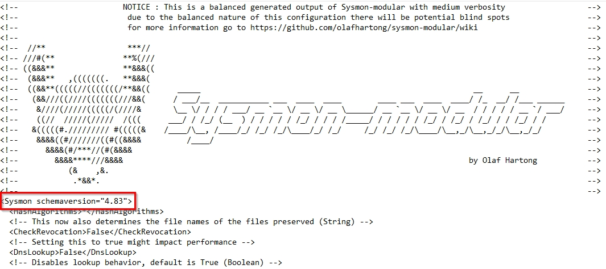
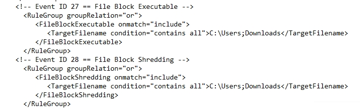
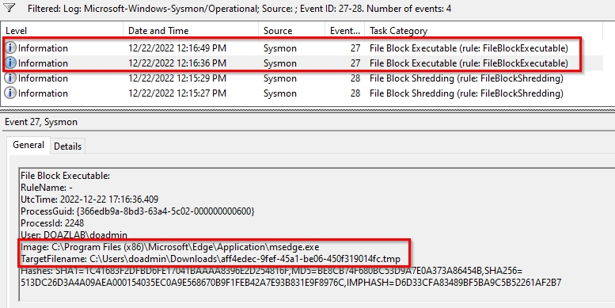
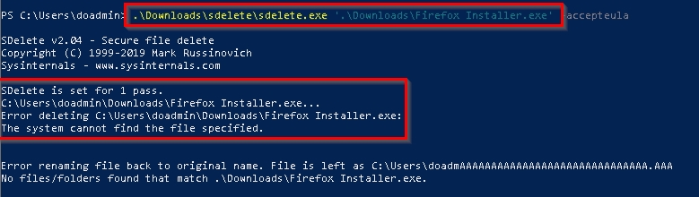
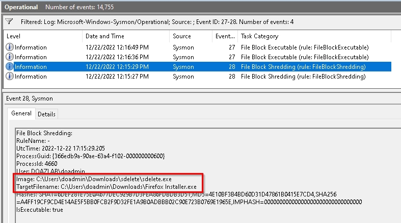
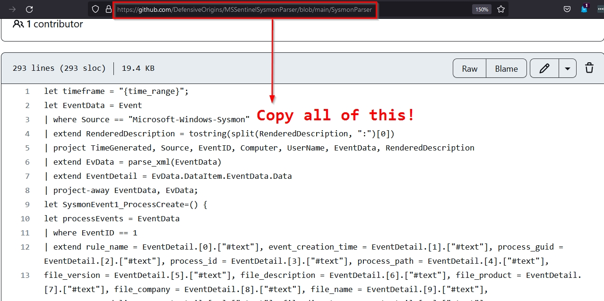
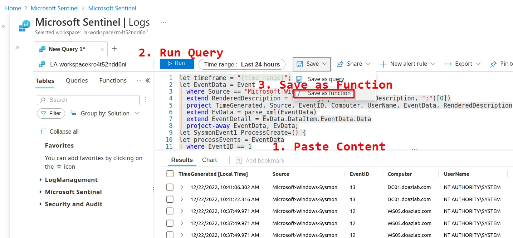
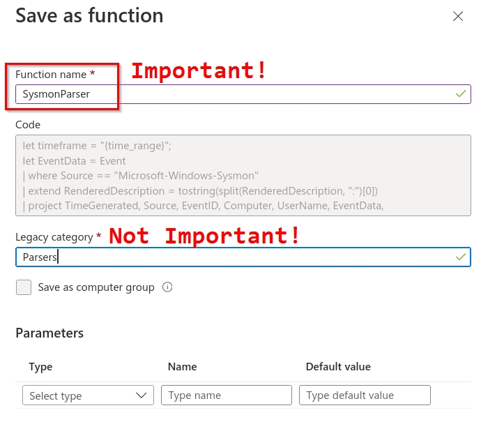
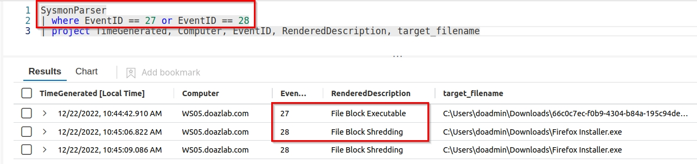

# MSSentinelSysmonParser
A simple parser for Sysmon logs through EID28 for Microsoft Sentinel

[Sysmon](https://learn.microsoft.com/en-us/sysinternals/downloads/sysmon) - the best system monitor for Windows! Even better than Windows auditing!

[Olaf Hartong's Sysmon Modular](https://github.com/olafhartong/sysmon-modular) - The best configuration generator for Sysmon ever shared with the world!

[Olaf Hartong's recent article on Sysmon EID 27 - file block executables](https://medium.com/@olafhartong/sysmon-14-0-fileblockexecutable-13d7ba3dff3e) - and the baseline for getting this written, the parser cleaned up, and pushed to GitHub.

https://github.com/DefensiveOrigins/MSSentinelSysmonParser/blob/main/SysmonParser

